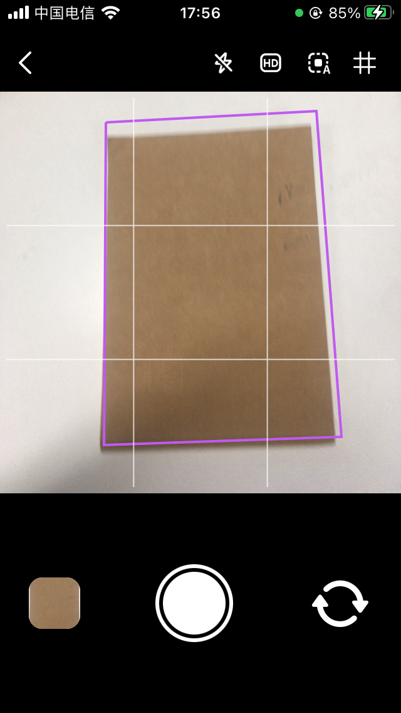
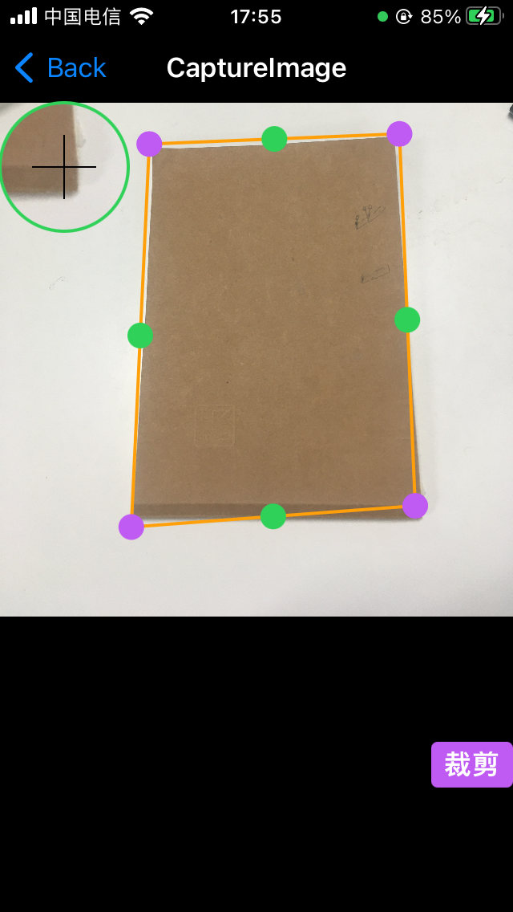

## AutoCropper

IOS SmartCropper Show CropRect Realtime

## How To Build

* Change bracnh to main
* `git pull`
* `git lfs pull`
* Build And Run

## Points

* TensorFlow
* OpenCV
* SwiftUI

## ScreenShot

* Show Cropper Real Time

* Show Cropper

